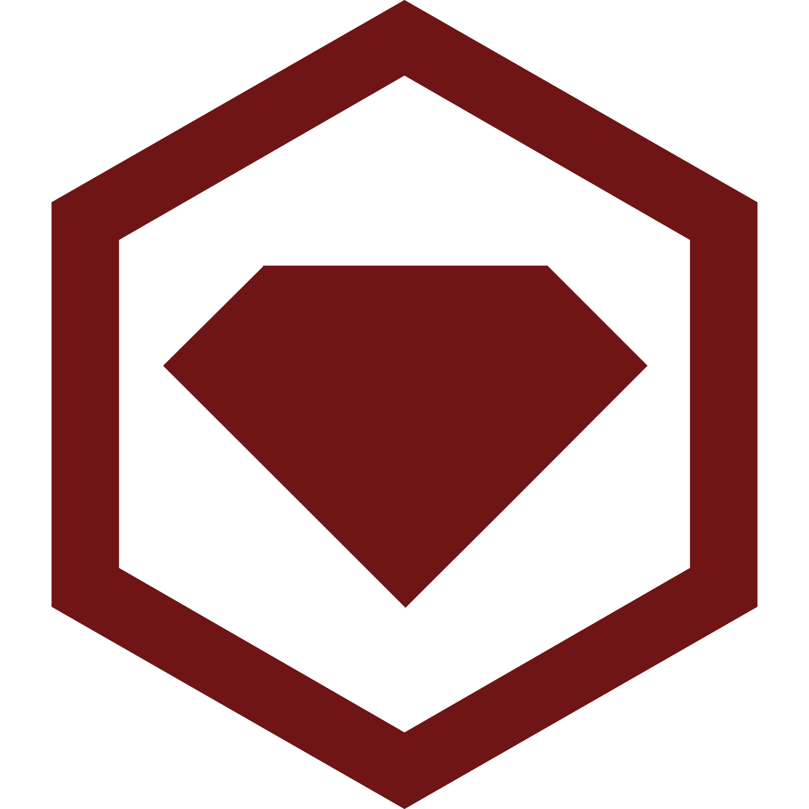
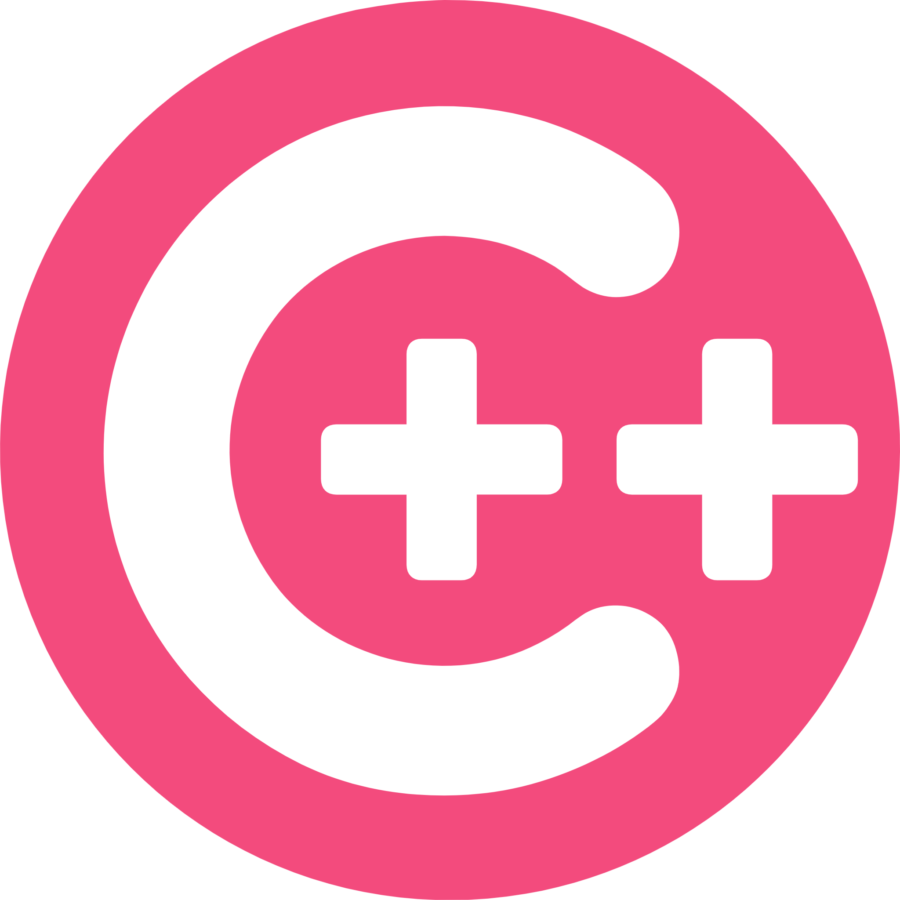
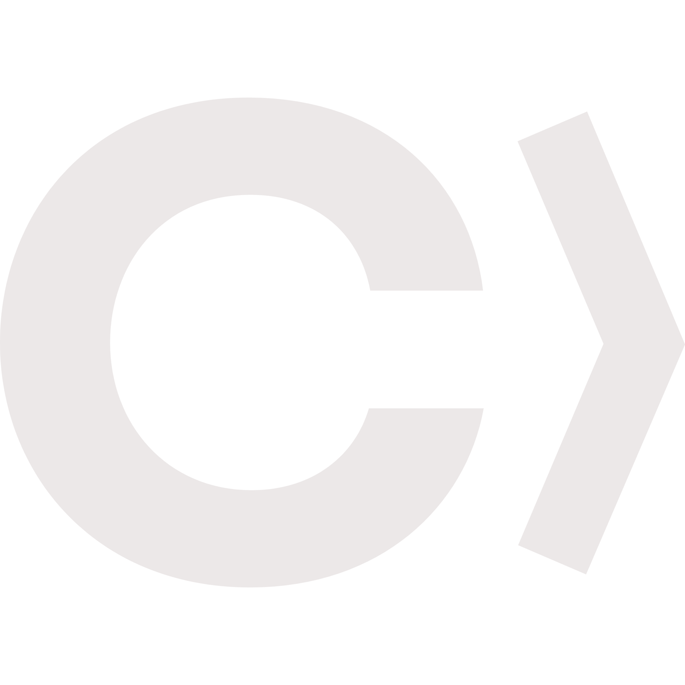
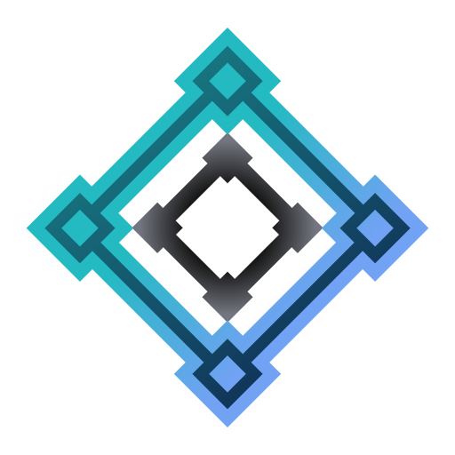
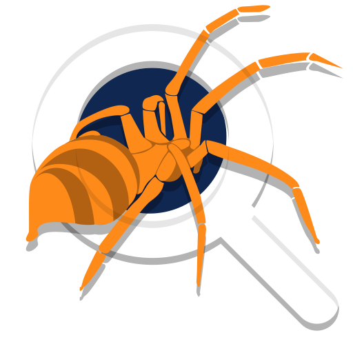
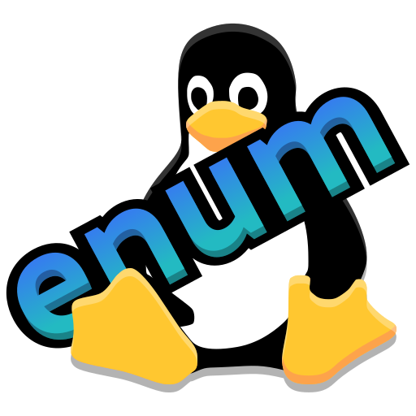
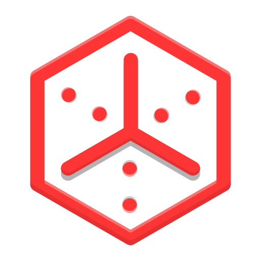
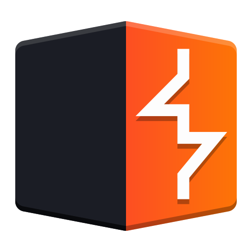
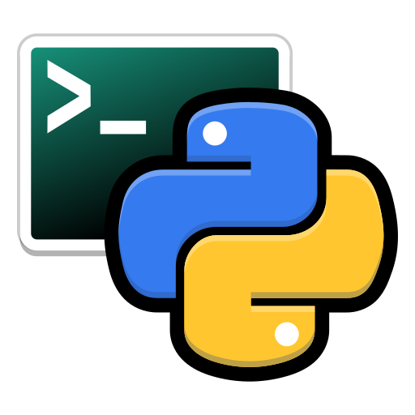

<!--
get icon list here
https://github.com/tandpfun/skill-icons?tab=readme-ov-file#icons-list
-->

<h1 align="center" style="display: inline-block; margin: 1rem auto">
 Hi there  I'm Brandy (storm🎃) a bounty hunter
</h1>

- 🔭 pentester and offsec enthusiast.

- 🧠 I’m currently
  - 🦀 learning python
  - 🚀 leveling up my skills on **[tryhackme](https://tryhackme.com/p/Lbstorm)**

- 👯 I’m looking to collaborate on a reasonable **real world** project with a team
<!-- - 🤔 I’m looking for help with ... -->
- ⚙️ Visit my Github Org **[lahfen-brandy](https://github.com/lahfen-brandy)**

- 📫 How to reach me:
  - **[in/lahfen](https://www.linkedin.com/in/lahfen-brandy-82a296353/)**
  - **[x/@lahfen](https://x.com/LahfenB34295)**
  - **[labex/@lbstorm](https://labex.io/users/lb-storm-38355818)**
  - **[intigriti/@fbstorm](https://app.intigriti.com/researcher/profile/fbstorm)**
  - **[bugcrowd/@fbstorm](https://bugcrowd.com/h/fbstorm)**
  - **[hacker0ne/@fbstorm](https://hackerone.com/fbstorma)**
  - **[hackthebox/@lbstorm](https://app.hackthebox.com/users/2388971)**
  - **[medium/@lahfenbrandy](https://medium.com/@lahfenbrandy)**
  - **<lahfenbrandy@gmail.com>**

<!-- - 😄 Pronouns: He/Him -->
<!-- - ⚡⚡ Fun fact:  -->

<!--
cool flowery effect

-->

  <h3 style="display: inline-block">
    My base languages ⚡
  </h3>

  
  
  
  
  

  <h3 style="display: inline-block">
    My Tools and Tech stack 👨🏻‍💻
  </h3>

      
   
  
       
   

      
   
         
   

      
  
   
  

  <h3 style="display: inline-block">
    ⚒️ Others ⚒️
  </h3>
  

     
 
 

 

  <h3 style="display: inline-block"> 
    📈 My Stats 📈
  </h3>

  

   

  

   

  

