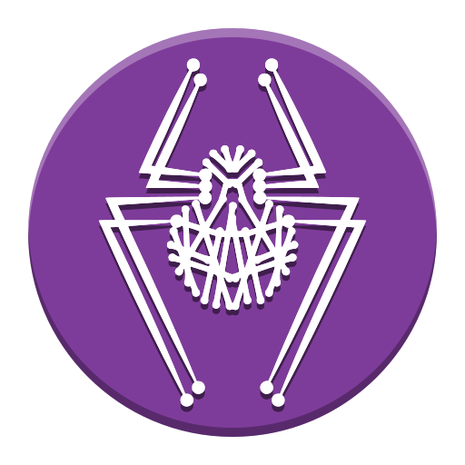

<!--
get icon list here
https://github.com/tandpfun/skill-icons?tab=readme-ov-file#icons-lists

https://icon-sets.iconify.design/simple-icons/
-->

<h1 align="center" style="display: inline-block; margin: 1rem auto">
 Hi there,  I'm Brandy (storm🎃) a 🐞 bounty hunter
</h1>

- 🔭 pentester and offsec enthusiast.

- 🧠 I’m currently
  - 🦀 learning python
  - 🚀 leveling up my skills on **[tryhackme](https://tryhackme.com/p/Lbstorm)**

- 👯 I’m looking to collaborate on a reasonable **real world** project with a team
- ⚙️ Visit my Github Org **[lahfen-brandy](https://github.com/lahfen-brandy)**

- 📫 How to reach me:
  - **[in/lahfen](https://www.linkedin.com/in/lahfen-brandy-82a296353/)**
  - **[x/@lahfen](https://x.com/LahfenB34295)**
  - **[labex/@lbstorm](https://labex.io/users/lb-storm-38355818)**
  - **[intigriti/@fbstorm](https://app.intigriti.com/researcher/profile/fbstorm)**
  - **[bugcrowd/@fbstorm](https://bugcrowd.com/h/fbstorm)**
  - **[hacker0ne/@fbstorm](https://hackerone.com/fbstorm)**
  - **[hackthebox/@lbstorm](https://app.hackthebox.com/users/2388971)**
  - **[medium/@lahfenbrandy](https://medium.com/@lahfenbrandy)**
  - **<lahfenbrandy@gmail.com>**
<!--

  <h3 style="display: inline-block">
    My base languages ⚡
  </h3>

  
  
  
  
  
  

  <h3 style="display: inline-block">
    My Tools and Tech stack 👨🏻‍💻
  </h3>

 
 
 
  
 
 
 
 
 
  
 
 
 
 
 
 
 
 
   
 
 
 
 
 
 
 
 
 
 
  
 
 
 
 
 
 
 
 
  
 
 
 
 
 
  
 

  <h3 style="display: inline-block">
    ⚒️ systems I've used ⚒️
  </h3>
  

 &nbsp;
 &nbsp;
 &nbsp;
 &nbsp;
  
 
 

  <h3 style="display: inline-block"> 
  
    📈 My Stats 📈
  </h3>

   

  

   

<!-- HACKVISER PROFILE
 ->

 -->
